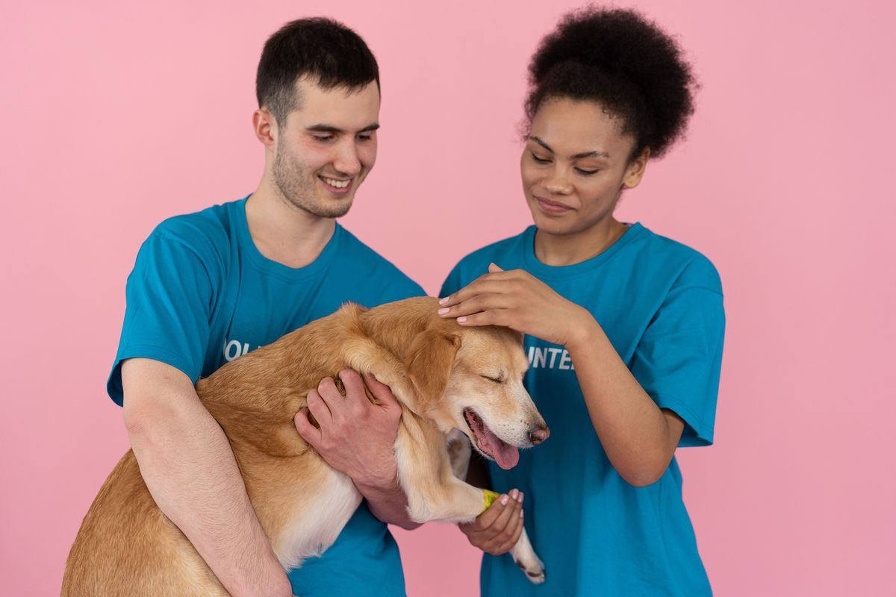

# Respostas para a plataforma (pt-BR)

Copie cada bloco para o campo indicado. A contagem de caracteres já foi conferida.

## 1. Fundamentos e estruturação

**Tags semânticas (adicionar uma a uma):** `header`, `nav`, `main`, `section`, `footer` (opcionais: `address`, `fieldset`, `legend`)

**Justificativa da hierarquia de títulos** (667/1000 caracteres)

```
Cada página tem um único <h1>, que define o tema central; os <h2> dividem o conteúdo em grandes blocos temáticos e os <h3> detalham subtópicos, sem pular níveis. Essa hierarquia reflete a estrutura lógica da informação e favorece a acessibilidade: leitores de tela usam os títulos para montar um sumário navegável, e pessoas com deficiência visual entendem a organização da página e vão direto à seção desejada. Também ajuda quem navega pelo teclado e melhora a indexação por mecanismos de busca (SEO), pois os títulos indicam a importância de cada trecho. As tags header, nav, main, section e footer complementam essa lógica, dando significado a cada área da página.
```

## 2. Página inicial (index.html)

**Trecho de código do index.html** (1639/5000 caracteres)

```
<!DOCTYPE html>
<html lang="pt-BR">
<head>
  <meta charset="UTF-8">
  <meta name="viewport" content="width=device-width, initial-scale=1.0">
  <meta name="description" content="ONG Amigos dos Animais: resgate, reabilitação e adoção responsável de animais em situação de abandono.">
  <title>Início - ONG Amigos dos Animais</title>
  <link rel="stylesheet" href="css/estilo.css">
</head>
<body>
  <a class="pular-conteudo" href="#conteudo">Pular para o conteúdo</a>

  <header>
    <h1>ONG Amigos dos Animais</h1>
    <nav aria-label="Navegação principal">
      <ul>
        <li><a href="index.html" aria-current="page">Início</a></li>
        <li><a href="projetos.html">Projetos</a></li>
        <li><a href="cadastro.html">Cadastro</a></li>
      </ul>
    </nav>
  </header>

  <main id="conteudo">
    <section>
      <h2>Quem Somos</h2>
      <p>Resgatamos, reabilitamos e encontramos lares amorosos para animais em situação de abandono e risco.</p>
      <picture>
        <source srcset="imagens/inicio-voluntarios-com-cao.webp" type="image/webp">
        
      </picture>
    </section>

    <section>
      <h2>Contato</h2>
      <address>
        E-mail: <a href="mailto:contato@amigosdosanimais.org">contato@amigosdosanimais.org</a><br>
        Telefone: <a href="tel:+5511988888888">(11) 98888-8888</a>
      </address>
    </section>
  </main>

  <footer>
    <p>&copy; 2026 ONG Amigos dos Animais. Todos os direitos reservados.</p>
  </footer>
</body>
</html>

```

**Estratégia de acessibilidade com a tag img e o atributo alt** (729/1000 caracteres)

```
A imagem foi inserida na seção "Quem Somos" para mostrar o trabalho de voluntariado e humanizar a página. Ela fica dentro da tag <picture>, que oferece o formato WebP, mais leve, e mantém a  em JPG como alternativa para navegadores antigos. Para acessibilidade, usei o atributo alt, obrigatório, com uma descrição objetiva da cena: "Dois voluntários de camiseta azul acariciando um cão caramelo". Assim, leitores de tela transmitem o conteúdo da imagem a quem não a enxerga, e o texto aparece se a imagem não carregar. Evitei descrições genéricas como "foto". Defini width e height no HTML, para reservar o espaço e evitar saltos na página, e no CSS max-width: 100% e height: auto, para a imagem se adaptar a telas pequenas.
```

## 3. Página de iniciativas (projetos.html)

**Bloco 1: Frentes de Atuação** (134/150 caracteres)

```
<section> com cabeçalho secundário (<h2>), parágrafo (<p>) e imagem (<picture> e ) que apresentam resgate, reabilitação e adoção.
```

**Bloco 2: Campanhas de Doação** (141/150 caracteres)

```
<section> com <h2>, imagem () e dois subtítulos (<h3>): doação financeira, em parágrafo (<p>), e de suprimentos, em lista (<ul> e <li>).
```

**Bloco 3: Programa de Voluntariado** (114/150 caracteres)

```
<section> com <h2>, parágrafo (<p>), imagem (), lista (<ul> e <li>) das tarefas e link (<a>) para o cadastro.
```

**Organização textual e estrutura (fluidez e clareza)** (774/1500 caracteres)

```
A página projetos.html foi dividida em três seções temáticas (section), cada uma com um título h2: Frentes de Atuação, Campanhas de Doação e Programa de Voluntariado. Essa segmentação separa assuntos diferentes e permite que o visitante encontre rápido o que procura. Quem quer doar vai direto à seção de doações, onde os h3 separam doação financeira e de suprimentos. Quem quer ser voluntário encontra as tarefas em uma lista (ul/li), mais fácil de ler que um parágrafo longo. Cada seção tem uma imagem que ilustra o tema, com texto alternativo descritivo. A hierarquia de títulos sem saltos também ajuda leitores de tela a navegar. Ao final do programa de voluntariado há um link para o cadastro, que liga a página ao próximo passo e conduz o usuário da informação à ação.
```

## 4. Cadastro: estrutura (cadastro.html)

**Agrupamento lógico com fieldset e legend** (664/1500 caracteres)

```
No cadastro.html, os campos foram agrupados em quatro fieldset, cada um com uma legend descritiva: Dados pessoais (nome, CPF e data de nascimento), Contato (e-mail e telefone), Endereço (CEP, endereço, cidade e estado) e Como você quer ajudar? (perfil de voluntário ou doador e mensagem). A legend dá contexto explícito, e não só visual: leitores de tela anunciam o nome do grupo ao entrar em cada campo, o que ajuda a entender o que está sendo pedido. Os grupos também dividem o formulário em etapas curtas, o que facilita o preenchimento. Além disso, cada campo tem um label ligado ao input pelos atributos for e id, e o atributo name identifica o dado no envio.
```

### Campos do formulário (modal: nome até 50 e tipo/justificativa até 150)

- **Nome do campo:** Nome completo (13/50)
  **Tipo e justificativa:** type="text": recebe texto livre. Tem id e name "nome", ligados ao label por for, e autocomplete="name". (103/150)

- **Nome do campo:** CPF (3/50)
  **Tipo e justificativa:** type="text" com pattern: type="number" removeria zeros à esquerda e a pontuação. id/name "cpf" e inputmode numérico. (116/150)

- **Nome do campo:** Data de nascimento (18/50)
  **Tipo e justificativa:** type="date": abre calendário nativo, padroniza a data e impede texto inválido. id e name "nascimento". (102/150)

- **Nome do campo:** E-mail (6/50)
  **Tipo e justificativa:** type="email": valida o formato (nome@dominio) sem JavaScript e abre teclado com @ no celular. id e name "email". (112/150)

- **Nome do campo:** Telefone (8/50)
  **Tipo e justificativa:** type="tel": abre teclado numérico no celular e aceita (), espaço e hífen. Usa pattern. id e name "telefone". (108/150)

- **Nome do campo:** CEP (3/50)
  **Tipo e justificativa:** type="text" com pattern: mantém o zero à esquerda e o hífen (00000-000). id e name "cep", autocomplete postal-code. (115/150)

- **Nome do campo:** Endereço (8/50)
  **Tipo e justificativa:** type="text": recebe rua e número, que são texto livre. id e name "endereco", ligados ao label. (94/150)

- **Nome do campo:** Cidade (6/50)
  **Tipo e justificativa:** type="text": nome da cidade em texto livre, com acentos. id e name "cidade", ligados ao label por for. (102/150)

- **Nome do campo:** Estado (6/50)
  **Tipo e justificativa:** select (sem type): lista fixa de 27 UFs, evita erros de digitação. id e name "estado", ligados ao label. (104/150)

- **Nome do campo:** Perfil de participação (22/50)
  **Tipo e justificativa:** type="radio": escolha única entre voluntário e doador. Os dois inputs compartilham o name "perfil". (99/150)


## 5. Cadastro: validações (pattern)

### Modal (nome até 60 e código até 500)

**Nome do campo:** CPF (3/60)

**Código da validação ou máscara aplicada** (120/500):

```
pattern="\d{3}\.\d{3}\.\d{3}-\d{2}" placeholder="000.000.000-00" title="Formato: 000.000.000-00" maxlength="14" required
```

**Nome do campo:** Telefone (8/60)

**Código da validação ou máscara aplicada** (119/500):

```
pattern="\(\d{2}\)\s\d{5}-\d{4}" placeholder="(00) 00000-0000" title="Formato: (00) 00000-0000" maxlength="15" required
```

**Nome do campo:** CEP (3/60)

**Código da validação ou máscara aplicada** (95/500):

```
pattern="\d{5}-\d{3}" placeholder="00000-000" title="Formato: 00000-000" maxlength="9" required
```

**Impacto na integridade dos dados** (831/1500 caracteres)

```
O atributo pattern recebe uma expressão regular e só deixa o formulário ser enviado se o valor digitado seguir o formato esperado. No cadastro, ele é aplicado ao CPF (000.000.000-00), ao telefone ((00) 00000-0000) e ao CEP (00000-000). O placeholder mostra o modelo, o title explica o formato quando há erro, e o maxlength limita o tamanho. Junto com required (campo obrigatório) e com os tipos email, tel e date, o navegador bloqueia o envio de campos vazios ou fora do padrão e avisa o usuário na hora, sem esperar a resposta do servidor. Isso reduz erros de digitação e mantém os dados padronizados. É importante saber que o pattern valida o formato, não a existência do dado: um CPF pode ter o formato certo e ser inválido. Como o usuário pode burlar a validação do navegador, o servidor também deve validar os dados recebidos.
```

## 6. Entrega final

**Código-fonte completo (limite 10000):** copie o conteúdo de `codigo-completo.txt`.

**Upload de imagens (anexar estes 8 arquivos da pasta imagens):**

- inicio-voluntarios-com-cao.jpg e inicio-voluntarios-com-cao.webp
- projetos-resgate-cuidadora-com-cao.jpg e projetos-resgate-cuidadora-com-cao.webp
- projetos-doacao-racao.jpg e projetos-doacao-racao.webp
- projetos-voluntariado-adote-me.jpg e projetos-voluntariado-adote-me.webp

Não anexe os arquivos originais pexels-*.jpg (são pesados).

**Diretórios:**

| Diretório | Arquivos |
|---|---|
| tarefa1 (raiz) | index.html, projetos.html, cadastro.html |
| css | estilo.css |
| imagens | inicio-voluntarios-com-cao, projetos-resgate-cuidadora-com-cao, projetos-doacao-racao, projetos-voluntariado-adote-me (cada um em .jpg e .webp) |
